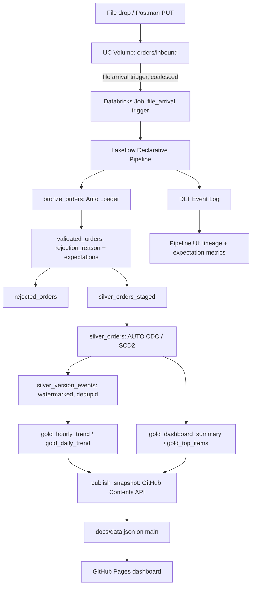

# pipeline-showcase

Orders streaming demo — Databricks Lakeflow Declarative Pipelines (Auto Loader + AUTO CDC SCD2 + watermarked streaming aggregation) → GitHub Pages dashboard.


## Live Dashboard

View the live dashboard here: [https://Aintareal.github.io/pipeline-showcase/](https://Aintareal.github.io/pipeline-showcase/)

## What this demonstrates

- **Databricks Asset Bundles** for the whole deployment (job, pipeline, triggers) as code.
- **Zero idle compute**: a Unity Catalog volume file-arrival trigger fires a serverless job — no always-on cluster, no schedule.
- **Lakeflow Declarative Pipelines (DLT)** with **AUTO CDC** for native SCD2, replacing a hand-built merge-key `MERGE` (see [Two implementations](#two-implementations-hand-built-scd2-vs-auto-cdc) below).
- **Hybrid data-quality validation**: a custom `rejection_reason` column that quarantines bad records with a specific, queryable reason, layered with native DLT `@dp.expect` metrics for pipeline-level observability.
- **Watermarked Structured Streaming aggregation** for the hourly/daily trend charts, reading an AUTO CDC target's own Change Data Feed from within the same pipeline.
- **DLT Event Log & lineage** — free pipeline-level observability (run history, expectation pass rates, dataset lineage) that the hand-built V1 pipeline didn't have. See [DLT Event Log](#dlt-event-log) below.
- **A zero-build-step, CDN-only dashboard** (Chart.js, no bundler) with a manual dark-mode toggle and per-chart table views.

## Screenshots

| Light | Dark |
|---|---|
|  |  |

## Architecture



## Two implementations: hand-built SCD2 vs. AUTO CDC

`main` runs the Lakeflow Declarative Pipelines / AUTO CDC version described in this README. The original, fully working implementation — a hand-built SCD2 `MERGE` keyed on a synthetic version hash, plain `spark_python_task` scripts, and its own live-debugged bug list — is preserved intact on the [`v1-manual-scd2`](https://github.com/Aintareal/pipeline-showcase/tree/v1-manual-scd2) branch, including its own commit history.

The contrast: V1 computes a `record_hash`/`version_id` per row and drives a synthetic-merge-key `MERGE` to detect changes — it works, but it's the kind of state-management code a managed feature exists to replace. V2's AUTO CDC does the same job by comparing actual column values against the current row, natively, with `__START_AT`/`__END_AT` version boundaries the platform manages. It also fixes a real V1 edge case for free: a value that reverts to match an old *superseded* version (`2 → 5 → 2`) is correctly re-versioned under AUTO CDC's value-comparison, where V1's hash-keyed `MERGE` would have silently no-op'd on the revert.

## DLT Event Log

Every Lakeflow pipeline maintains an event log — queryable via the `event_log()` table-valued function or the Pipeline UI's Event Log tab — capturing run history, dataset lineage, and pass/fail metrics for every `@dp.expect(...)` annotation in `dlt_silver.py`. This is genuine, free observability the V1 pipeline didn't have. Example query against a running pipeline:

```sql
SELECT event_type, message, timestamp
FROM event_log(TABLE(orders_dlt_pipeline))
WHERE event_type = 'flow_progress'
ORDER BY timestamp DESC
LIMIT 20;
```

## Engineering Narrative

Both builds were live-verified against real serverless compute, and both surfaced bugs that only showed up under actual deployment — not in code review. Documented here without commit references, since squashing or rebasing would make those stale.

**V1 (hand-built SCD2):**
- **`ModuleNotFoundError: No module named 'src'` under `spark_python_task`.** The task runner `exec`s the file directly — `__file__` is undefined, so a naive relative import fails. Fixed with a `sys.path` shim using an `inspect.currentframe()` fallback when `__file__` isn't available.
- **`dbutils` not auto-injected.** `dbutils` is only automatically available inside notebooks, not plain Python scripts run as a `spark_python_task`. Fixed via the `databricks.sdk.runtime` shim, which provides the same interface outside a notebook context.
- **`.persist()` unsupported on serverless compute.** Serverless Spark Connect rejects explicit caching (`NOT_SUPPORTED_WITH_SERVERLESS`). Removed — the query was cheap enough not to need it.
- **A two-part lazy-view bug that silently zeroed `silver_version_events` for two full runs.** Under Spark Connect, a temp view read twice — once by a `MERGE`, once later in the same script — gets silently *re-executed* on the second read, reflecting post-mutation state instead of the state at the time it was first computed. Fixed by materializing the view once via `.collect()` and rehydrating it into a frozen in-memory DataFrame before any further reads.
- **Streaming `outputMode` defaulting to `append`, which never emits within one triggered batch.** A watermarked aggregation with the default `append` output mode only emits a window once the watermark has fully passed it — which never happens within a single `AvailableNow` triggered run. Fixed with `outputMode("update")`.
- **A redundant second `.withWatermark()` call**, which Structured Streaming rejects ("redefining watermark is disallowed") once a watermark is already set earlier in the same query lineage. Removed the duplicate.
- By contrast, a bug where Auto Loader defaulted every JSON column to `STRING` (missing `inferColumnTypes`, causing every record to fail quantity validation) *was* caught by review before deploy — a useful contrast: some classes of bug are catchable by reading the code carefully, some genuinely aren't until the platform's actual runtime behavior is exercised.

**V2 (Lakeflow Declarative Pipelines / AUTO CDC):**
- **A stale streaming checkpoint silently zeroed out `silver_orders`.** After iterating through several drop-table-and-redeploy cycles during development, an AUTO CDC flow's checkpoint ended up pointing at a Delta table UUID from an earlier incarnation of `bronze_orders` (`DIFFERENT_DELTA_TABLE_READ_BY_STREAMING_SOURCE`), and a plain `--full-refresh` alone didn't clear it — the pipeline reported `COMPLETED` while its target table silently stayed empty. Fixed by deleting and redeploying the pipeline resource itself, which allocates a fresh checkpoint storage root.
- **`track_history_except_column_list` doesn't keep a row in-place when the excluded column is also the `sequence_by` column.** The design assumed excluding `created_time` (an ingestion-arrival timestamp, not a business value) from history tracking would let a resubmission with only a new `created_time` update silently in place. In practice, since `created_time` is also what `sequence_by` orders on, every resubmission still gets its own `__START_AT`/version row — confirmed live, not caught by an earlier small-scale prototype of the same configuration.
- **The resulting duplicate-event fix over-corrected on the first attempt.** Deduping the events feed on the full tracked-value tuple (rather than the version boundary) correctly collapsed the arrival-timestamp-only duplicates, but also silently dropped a genuine *revert* (`quantity: 2 → 5 → 2`) as if it were a repeat of the first "2" — breaking the exact behavioral improvement over V1 this design was meant to showcase. Fixed by comparing each version only against its immediate predecessor via a stream-static join (linking each event's `__START_AT` to the prior row's `__END_AT`), since Structured Streaming doesn't support row-based window functions like `LAG` on a streaming source.

## Demo Script

1. Open the [live dashboard](https://Aintareal.github.io/pipeline-showcase/).
2. Drop a seed file (or run a Postman request) into the inbound volume.
3. Watch the job start in the Databricks Jobs UI (file-arrival trigger firing), then the pipeline's dataflow graph run in the Pipeline UI.
4. Query `bronze_orders`, then `silver_orders` — point out the `__START_AT`/`__END_AT` columns for a changed-duplicate, and that no `is_current` column is auto-generated (it's a derived view).
5. Refresh the dashboard — new counts, updated trend chart, toggle a chart to its table view.
6. Send an invalid-record Postman request.
7. Query `rejected_orders` — show the `rejection_reason`.
8. Open the Pipeline UI's Event Log tab — show the `@dp.expect` metrics for the same batch.
9. Refresh the dashboard again — rejection count/rate ticked up, active vs. superseded bar updated. Toggle dark mode.

## Known Limitations

- **2-hour watermark window:** the gold watermark assumes demo/seed timestamps stay roughly "now-relative"; a demo record backdated by more than 2 hours relative to the latest-seen event would be dropped from the trend aggregation (though it would still land correctly in `silver_orders`).
- **`_gold_hourly_trend_raw` is internal plumbing**, reproducing the 24h pruning a materialized-view refresh would give for free — an acceptable amount of ceremony at this data volume, but worth flagging as a design tradeoff rather than a necessity.
- **AUTO CDC event-dedup relies on a stream-static join** against `silver_orders`'s own current state rather than a fully self-contained streaming transform — correct and tested, but a slightly less obvious pattern than a plain filter.

## Repository Structure

```
pipeline-showcase/
├── README.md
├── databricks.yml
├── dlt_bronze.py                  # DLT: Auto Loader ingest
├── dlt_silver.py                  # DLT: validation, rejection routing, AUTO CDC, version events
├── dlt_gold.py                    # DLT: watermarked trends + batch aggregates
│
├── docs/                          # GitHub Pages dashboard (published from main)
│   ├── index.html                 # Dashboard UI
│   ├── app.js                     # Dashboard client-side logic
│   ├── styles.css                 # Dashboard styling
│   ├── data.json                  # Published data (auto-generated)
│   ├── screenshots/                # README screenshots (light/dark/hero)
│   └── .nojekyll                  # Disable Jekyll for GitHub Pages
│
├── src/
│   ├── __init__.py
│   ├── publish_snapshot.py        # GitHub Contents API publisher (spark_python_task)
│   └── common/
│       ├── __init__.py
│       ├── validation.py          # Validation rules and schemas
│       └── paths.py               # UC paths and table references
│
├── postman/                       # API testing
│   ├── pipeline-showcase.postman_collection.json
│   └── pipeline-showcase.postman_environment.example.json
│
├── scripts/                       # Data generation and utilities
│   ├── generate_seed_data.py      # Seed data generator
│   └── seed_files/                # Example seed files
│
├── resources/                     # Job and pipeline definitions
│   ├── orders_pipeline.job.yml     # Databricks job config (file_arrival trigger, 2 tasks)
│   └── orders_dlt.pipeline.yml     # Lakeflow Declarative Pipeline config
│
└── tests/                         # Unit tests
    └── test_validation.py
```

## Cost

- **GitHub Pages:** free (public repo).
- **Databricks serverless compute:** only runs when triggered by file arrival — no idle/scheduled compute, no always-on cluster.
- **Storage:** a handful of small Delta tables — negligible.

## Postman Setup

### Import the Postman Collection and Environment

1. **Download Postman:** If you haven't already, install [Postman](https://www.postman.com/downloads/).

2. **Import the collection:**
   - In Postman, click **File → Import**.
   - Select `postman/pipeline-showcase.postman_collection.json`.
   - Click **Import**.

3. **Create a local environment:**
   - Copy `postman/pipeline-showcase.postman_environment.example.json` to `postman/pipeline-showcase.postman_environment.json` (in your local repo, **never commit the filled-in environment**).
   - Edit the new file with your Databricks credentials:
     - `DATABRICKS_HOST`: Your Databricks workspace URL (e.g., `https://my-workspace.cloud.databricks.com`).
     - `DATABRICKS_TOKEN`: Your Databricks API token.
     - `ORDERS_PATH`: The UC volume path for order inbound files (default: `/Volumes/portfolio_demo/orders/inbound`).

4. **Load the environment in Postman:**
   - In Postman, click the environment dropdown (top right).
   - Click **Import** and select your `pipeline-showcase.postman_environment.json`.
   - Select the imported environment from the dropdown.

5. **Run requests:**
   - Open any request in the collection.
   - Click **Send** to execute it (it will use the environment variables you configured).

### Environment File Security

**Important:** The `pipeline-showcase.postman_environment.json` file (with your real Databricks credentials) should **never be committed** to git. It is listed in `.gitignore` by default. Always use the `.example.json` template for sharing setup instructions with team members.
