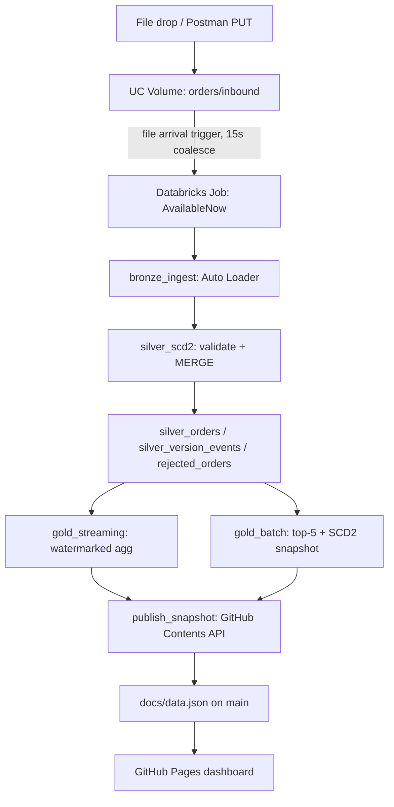

# pipeline-showcase

Orders streaming demo — Databricks (Auto Loader + Structured Streaming + SCD2) -> GitHub Pages dashboard.

## Architecture



## Live Dashboard

View the live dashboard here: [https://Aintareal.github.io/pipeline-showcase/](https://Aintareal.github.io/pipeline-showcase/)

## Cost

- **GitHub Pages:** free (public repo).
- **Databricks serverless job compute:** only runs when triggered by file arrival — no idle/scheduled compute, no always-on cluster.
- **Storage:** a handful of small Delta tables — negligible.

## Demo Script

1. Open the [live dashboard](https://Aintareal.github.io/pipeline-showcase/).
2. Drop a seed file (or run a Postman request) into the inbound volume.
3. Watch the job start in the Databricks Jobs UI (file-arrival trigger firing).
4. Query `bronze_orders`, then `silver_orders` — point out the `is_current`/`effective_end_dt` split for a changed-duplicate.
5. Refresh the dashboard — new counts, updated trend chart.
6. Send an invalid-record Postman request.
7. Query `rejected_orders` — show the `rejection_reason`.
8. Refresh the dashboard again — rejection count/rate ticked up, active vs. superseded bar updated.

## Known Limitations

- **SCD2 version hash collision:** `version_id` is a hash of `(order_id, record_hash)`. If a value ever reverts to a byte-identical match with an older *superseded* version of the same order, the MERGE will no-op instead of creating a new current version. Out of scope for this demo.
- **Batch, not incremental aggregation:** Gold's top-5 leaderboard and active/superseded snapshot are computed via a small batch query, not incremental streaming aggregation — ranking and mutable-flag snapshots aren't naturally expressible as a windowed streaming aggregate.
- **2-hour watermark window:** The gold watermark assumes demo/seed timestamps stay roughly "now-relative"; a demo record backdated by more than 2 hours relative to the latest-seen event would be dropped from the trend aggregation (though it would still land correctly in `silver_orders`).

## Repository Structure

```
pipeline-showcase/
├── README.md
├── databricks.yml
│
├── docs/                          # GitHub Pages dashboard (published from main)
│   ├── index.html                 # Dashboard UI
│   ├── app.js                     # Dashboard client-side logic
│   ├── styles.css                 # Dashboard styling
│   ├── data.json                  # Published data (auto-generated)
│   └── .nojekyll                  # Disable Jekyll for GitHub Pages
│
├── src/                           # Python pipeline code
│   ├── __init__.py
│   ├── bronze_ingest.py           # Auto Loader + ingest
│   ├── silver_scd2.py             # SCD2 merge + validation
│   ├── gold_streaming.py          # Watermarked streaming aggregation
│   ├── gold_batch.py              # Batch snapshot (top-5, active/superseded)
│   ├── gold_and_publish.py        # Coordinator for gold + GitHub publish
│   ├── publish_snapshot.py        # GitHub Contents API publisher
│   └── common/                    # Shared utilities
│       ├── __init__.py
│       ├── hashing.py             # Record and version hashing
│       ├── validation.py          # Validation rules and schemas
│       └── paths.py               # UC paths and table references
│
├── postman/                       # API testing
│   ├── pipeline-showcase.postman_collection.json
│   └── pipeline-showcase.postman_environment.example.json
│
├── scripts/                       # Data generation and utilities
│   ├── generate_seed_data.py      # Seed data generator
│   └── seed_files/                # Example seed files
│       ├── seed-ORD-10001.json
│       ├── seed-ORD-10002.json
│       └── ...
│
├── resources/                     # Job and config definitions
│   └── orders_pipeline.job.yml    # Databricks job config (AvailableNow)
│
└── tests/                         # Unit tests
    ├── test_hashing.py
    └── test_validation.py
```

## Postman Setup

### Import the Postman Collection and Environment

1. **Download Postman:** If you haven't already, install [Postman](https://www.postman.com/downloads/).

2. **Import the collection:**
   - In Postman, click **File → Import**.
   - Select `postman/pipeline-showcase.postman_collection.json`.
   - Click **Import**.

3. **Create a local environment:**
   - Copy `postman/pipeline-showcase.postman_environment.example.json` to `postman/pipeline-showcase.postman_environment.json` (in your local repo, **never commit the filled-in environment**).
   - Edit the new file with your Databricks credentials:
     - `DATABRICKS_HOST`: Your Databricks workspace URL (e.g., `https://my-workspace.cloud.databricks.com`).
     - `DATABRICKS_TOKEN`: Your Databricks API token.
     - `ORDERS_PATH`: The UC volume path for order inbound files (default: `/Volumes/portfolio_demo/orders/inbound`).

4. **Load the environment in Postman:**
   - In Postman, click the environment dropdown (top right).
   - Click **Import** and select your `pipeline-showcase.postman_environment.json`.
   - Select the imported environment from the dropdown.

5. **Run requests:**
   - Open any request in the collection.
   - Click **Send** to execute it (it will use the environment variables you configured).

### Environment File Security

**Important:** The `pipeline-showcase.postman_environment.json` file (with your real Databricks credentials) should **never be committed** to git. It is listed in `.gitignore` by default. Always use the `.example.json` template for sharing setup instructions with team members.
